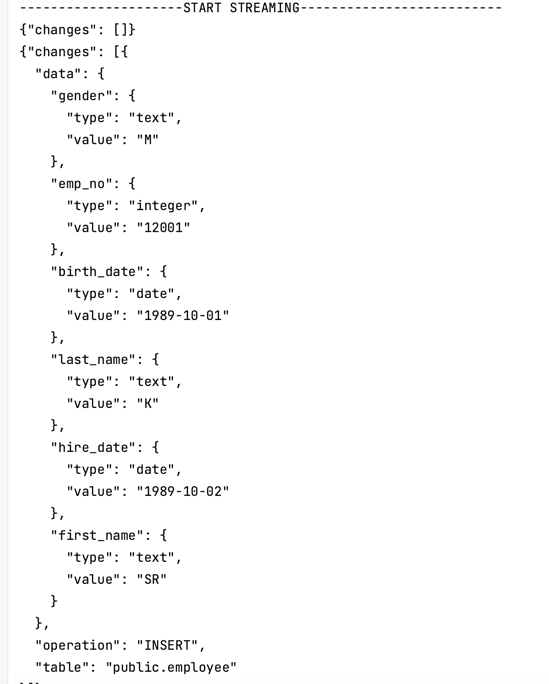

# Outbox Pattern: Run Book

## Checkout Code
```
git clone https://github.com/rajat965ng/outboxPattern.git
```

## Bootstrap Postgres and PGadmin
```
cd outboxPattern/ & podman-compose up
```

## Create Connection


## Create publication
```
CREATE PUBLICATION my_publication FOR TABLE employee, department;

```

## Create Table Slot for this publication
```
select pg_create_logical_replication_slot('test_slot_1', 'test_decoding');

```

## Start your PGStream listen app


## Test Insert Streaming
```
INSERT INTO employee VALUES (12001,'1989-10-01','SR','K','M','1989-10-02');
INSERT INTO employee VALUES (12002,'1989-10-01','AB','B','M','1989-10-02');
INSERT INTO department values ('d010','New Dept1');
```

## JSON Output
