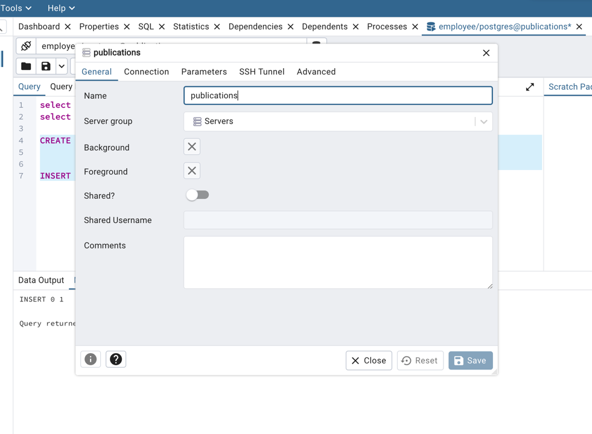
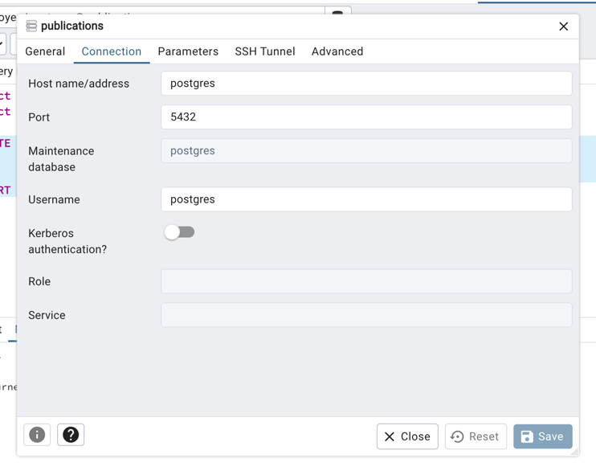
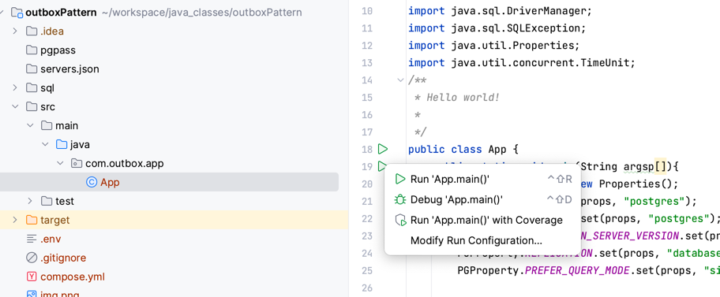

# Outbox Pattern: RUN BOOK

## Checkout Code
```
git clone https://github.com/rajat965ng/outboxPattern.git
```

## Bootstrap Postgres and PGadmin
```
cd outboxPattern/ & podman-compose up
```

## Create Connection





## Create publication
```
CREATE PUBLICATION my_publication FOR TABLE employee, department;

```

## Start your PGStream listen app
```

```

## Test Insert Streaming
```
INSERT INTO employee VALUES (12000,'1989-10-01','Rajat','Nigam','M','1989-10-02');
```